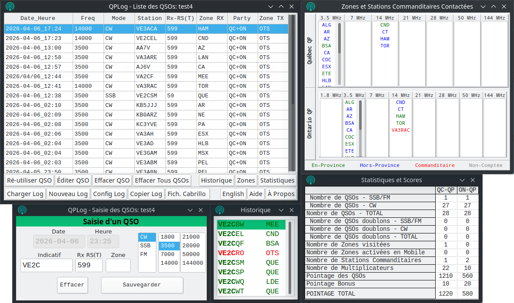

# QPLog - QSO Party Logger

## Français
QPLog est un logiciel PC qui permet de saisir et d’analyser les contacts radio (QSO) durant les compétitions “contest” radio amateur suivantes: le Québec QSO Party (QCQP) et l’Ontario QSO Party (ONQP). L’idée derrière la creation de ce logiciel était de produire un environnement de contest facile à installer, simple à opérer, et fait sur mesure pour ces deux contests. Ce projet de logiciel a été élaboré par Georges-André Chaudron (VE2VAB) et Bertrand Zauhar (VE2ZAZ - VA2IW), et la version initiale a été développée par ce dernier en 2024.

QPLog est conçu pour une participation coïncidente, si désirée, du QCQP et de l’ONQP. En outre, il compile les scores à la volée et de façon indépendante pour chacun des deux Parties, mais tient compte des contacts éligibles dans les deux contests.
QPLog permet aussi une opération nomade, donc prend en compte les changements de région administrative (zone) de l’opérateur durant le contest.

Un fois le contest terminé, QPLog peut produire un fichier de format Cabrillo, que le participant soumet à l’organisation du contest pour officialiser sa participation et fournir la liste des QSOs.

QPLog est disponible en versions pré-compilées pour Windows 32/64 bits (7, 8, 10, 11) et Ubuntu Linux (Ubuntu 22.xx, 24.xx). La version Linux pourrait aussi fonctionner sur d’autres distributions; elle a entre autres été vérifiée sur Arch Linux xxxx). Certains pilotes pourraient cependant être requis.

Pour plus d'information sur ce logiciel, veuillez consulter le .

## English
QPLog is a PC software that allows the entry and analysis of radio contacts (QSOs) during the following amateur radio "contest": the Québec QSO Party (QCQP) and the Ontario QSO Party (ONQP). The idea behind the creation of this software was to produce an easy-to-install contest environment, simple to operate, and customized for these two contests. This software project was detailed by Georges-André Chaudron (VE2VAB) and Bertrand Zauhar (VE2ZAZ - VA2IW), with the initial version developed by the latter in 2024.

QPLog is designed for simultaneous participation, if desired, in the QCQP and ONQP. Furthermore, it compiles scores on the fly and independently for each of the two parties, while considering eligible contacts in both contests.
QPLog also allows for mobile operation, accounting for changes in the operator's administrative region (zone) during the contest.

Once the contest is over, QPLog can produce a Cabrillo format file, which the participant submits to the contest organization to formalize their participation and provide the list of QSOs.

QPLog is available in pre-compiled versions for Windows 32/64 bits (7, 8, 10, 11) and Ubuntu Linux (Ubuntu 22.xx, 24.xx). The Linux version may also work on other distributions; it has been verified to run, for example, on Arch Linux. However, certain drivers may be required.

For more details on this software, please consult the .
